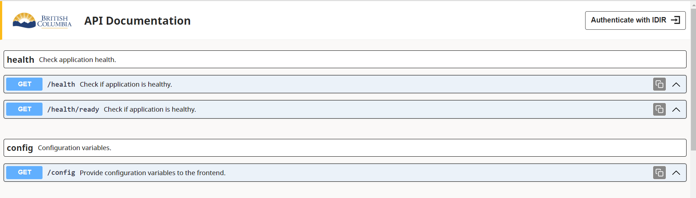

# BCGov Express + SSO Keycloak API Documentation

[](Redirect-URL)
[](LICENSE)


[](NodeJS)
[](Typescript)
[](Express)

## Backlog:

- Make generateDocs work with Vanilla vs TypeScript and Development vs Production
- Add support for body
- Get and display responses
- Clean up login button state
- Add entities
- Add minimize all button for modules
- Describe syntax and structure requirements/limitations in README
- Expand login to more than just IDIR
- Check for protectedRoute on router routes
- Check for describe in zod schema to add to params

<br />

<details>
<summary><h2>TL/DR</h2></summary>

1. Install package by following the steps at [Installing the Package](#installing-the-package).
2. Set up the package by following the steps at [Basic Setup Guide](#basic-setup-guide).
3. Use with [@bcgov/citz-imb-kc-express].
4. Allows automatic generation of api documentation and integration with Keycloak SSO protected endpoints.

</details>

---

## Table of Contents

- [General Information](#general-information)
- [Installing the Package](#installing-the-package) - **Start Here!**
- [Basic Setup Guide](#basic-setup-guide) - Setting up after installing.
- [Environment Variables](#environment-variables) - Required variables for initialization.
- [Directory Structure](#directory-structure) - How the repo is designed.
- [Scripts](#scripts) - Scripts for running and working on the package.
- [Module Exports](#module-exports) - Functions available from the module.
- [TypeScript Types](#typescript-types) - Available TypeScript types.
- [Applications using this Solution](#applications-using-this-solution) - See an example of how to use.

## General Information

- For running on a NodeJS:20 Express API.
- Works with Vanilla JavaScript or Typescript 5.
- Use with [@bcgov/citz-imb-kc-express].
- Allows automatic generation of api documentation and integration with Keycloak SSO protected endpoints.

*Example:*



---

<br />

## Installing the Package

1. Add the following line to your `package.json`:

``` JSON5
{
  "dependencies": {
    "@bcgov/citz-imb-kc-express-api-docs": "https://github.com/bcgov/citz-imb-kc-express-api-docs/releases/download/v<VERSION>/bcgov-citz-imb-kc-express-api-docs-<VERSION>.tgz",
    // The rest of your dependencies...
  },
}
```

2. Replace `<VERSION>` with the version you wish to use. Reference [releases] for version numbers.

<br />

3. Run `npm install` to add the package.

[Return to Top](#bcgov-express-+-sso-keycloak-api-documentation)

<br />

## Basic Setup Guide

1. Add import `const { apiDocs } = require('@bcgov/citz-imb-kc-express-api-docs');` or `import { apiDocs } from '@bcgov/citz-imb-kc-express-api-docs';` to the top of the file that defines the express app. Add `apiDocs(app, API_DOCS_CONFIG);` below the definition of the express app, where `app` is defined by `express()`.

*Note the default config options:*

``` JavaScript
// Automatically set, unless changed
const DefaultAPIDocsConfig = {
  title: "API Documentation",
  expressFilePath: "src/express.ts",
  modulesBasePath: "src/modules",
  modules: {},
};
```

*Example:*

```JavaScript
import express from 'express';
import { apiDocs } from '@bcgov/citz-imb-kc-express-api-docs';

const API_DOCS_CONFIG = {
  modules: {
    health: {
      description: 'Check application health.',
    },
  },
  customSchemas: { // This is an optional property.
    'zodProperty.nonEmptyString': { // Example of custom zod schema object.
      required: true,
      type: 'string',
    },
  },
  customControllers: {  // This is an optional property.
    'dataController.getAllItems': {
      description: 'Returns all items.',
      // optional add query property (see TypeScript types).
    },
  },
  customResponseStatuses: { // This is an optional property.
    'statusCode.OK': 200,
    'statusCode.CREATED': 201,
    'statusCode.ACCEPTED': 202,
    'statusCode.NO_CONTENT': 204,
    'statusCode.NOT_MODIFIED': 304,
    'statusCode.BAD_REQUEST': 400,
    'statusCode.UNAUTHORIZED': 401,
    'statusCode.FORBIDDEN': 403,
    'statusCode.NOT_FOUND': 404,
    'statusCode.IM_A_TEAPOT': 418,
    'statusCode.INTERNAL_SERVER_ERROR': 500,
    'statusCode.NOT_IMPLEMENTED': 501,
    'statusCode.SERVICE_UNAVAIBLABLE': 503,
  },
  defaultResponses: [500], // This is an optional property.
};

// Define Express App
const app = express();

// Initialize api docs
apiDocs(app, API_DOCS_CONFIG);
```

2. Add the required environment variables from the [Environment Variables](#environment-variables) section below.

[Return to Top](#bcgov-express-+-sso-keycloak-api-documentation)

<br />

## Environment Variables

```ENV
# Ensure the following environment variables are defined on the container.

BACKEND_URL= # URL of the backend application.

SSO_CLIENT_ID= # Keycloak client_id
SSO_CLIENT_SECRET= # Keycloak client_secret
SSO_AUTH_SERVER_URL= # Keycloak auth URL, see example below.
# https://dev.loginproxy.gov.bc.ca/auth/realms/standard/protocol/openid-connect

DEBUG= # (optional) Set to 'true' to get useful debug statements in api console.
VERBOSE_DEBUG= # (optional) Set to 'true' to get extra details from DEBUG.
```

[Return to Top](#bcgov-express-+-sso-keycloak-api-documentation)

<br />

## Directory Structure

```
.
├── .github/
|   ├── config/
|   |   └── dep-report.json5                # Configure options for NPM Dep Report.
|   ├── helpers/
|   |   ├── github-api/                     # Functions to access the GitHub API.
|   |   ├── create-npm-dep-report-issues.js # Creates GitHub Issues for Npm Dep Reports.
|   |   ├── create-npm-dep-report.js        # Creates text bodies for Npm Dep Reports.
|   |   ├── parse-json5-config.js           # Parses json5 files for GitHub actions output.
|   |   └── parse-npm-deps.js               # Parses package.json files for changes to package versions.
|   ├── workflows/
|   |   ├── npm-dep-report.yaml             # Reports on new package versions.
|   |   └── releases.yaml                   # Creates a new GitHub Release.
├── .husky/
|   └── post-commit                         # Script that runs after a git commit.
├── scripts/
|   ├── bump-version.mjs                    # Bumps version in package.json file.
|   ├── post-commit-version-change.mjs      # Bumps version when post-commit is run.
|   ├── remove-dts-files.mjs                # Removes TypeScript declaration files from the build.
|   └── remove-empty-dirs.mjs               # Removes empty directories from the build.
├── src/                                    # Source code for package.
|   ├── static/                             # Static files served as the api documentation.
|   ├── utils/                              # Utility functions.
|   ├── config.ts                           # Config variables.
|   ├── index.ts                            # Export functions for the package.
|   └── types.ts                            # TypeScript types.
├── package.json                            # Package config and dependencies.
├── .npmrc                                  # NPM config.
├── rollup.config.mjs                       # Builds and compiles TypeScript files into JavaScript.
├── rollupdts.config.mjs                    # Builds and compiles TypeScript declartion files.
```

[Return to Top](#bcgov-express-+-sso-keycloak-api-documentation)

<br />

## Scripts

```bash
# Compile all src code into a bundle in build/ directory.
$ npm run build
```

```bash
# Part of 'build' and it bundles the typescipt declarations into a single bundle.d.ts file.
$ npm run build:dts
```

```bash
# Part of build and it removes directories and files before the build.
$ npm run clean:prebuild
```

```bash
# Part of build and it removes directories and files after the build.
$ npm run clean:postbuild
```

```bash
# Used to package the code before a release.
$ npm run pack
```

[Return to Top](#bcgov-express-+-sso-keycloak-api-documentation)

<br />

## Module Exports

These are the functions and types exported by the `@bcgov/citz-imb-kc-express-api-docs` module.

```JavaScript
import {
  apiDocs, // Initialization function to generate api docs.
} from '@bcgov/citz-imb-kc-express-api-docs';

// TypeScript Types:
import {
  Config, // Type for configuration options.
} from '@bcgov/citz-imb-kc-express';

```

[Return to Top](#bcgov-express-+-sso-keycloak-api-documentation)

<br />

## TypeScript Types

These are the TypeScript types of the `@bcgov/citz-imb-kc-express-api-docs` module.

```TypeScript
const apiDocs: (app: Application, config: Config) => void;

type CustomSchemaConfig = {
    [pattern: string]: ParamProperties;
};
type CustomControllerConfig = {
  [controller: string]: {
    description: string;
    query?: {
      [param: string]: ParamProperties;
    };
  };
};
type CustomResponseStatuses = {
  [variable: string]: number;
};
type Config = {
  title: string;
  expressFilePath: string;
  modulesBasePath: string;
  modules: {
    [module: string]: {
      description: string;
    };
  };
  customSchemas?: CustomSchemaConfig;
  customControllers?: CustomControllerConfig;
  customResponseStatuses?: CustomResponseStatuses;
  defaultResponses?: number[];
};
type Method = "GET" | "POST" | "PATCH" | "PUT" | "DELETE";
type ParamProperties = {
    required: boolean;
    type: string; // "string" | "number" | "boolean"
};
type Endpoint = {
    route: string;
    method: Method;
    description?: string;
    controller: {
        name: string;
        path: string;
        query?: {
            [param: string]: ParamProperties;
        };
        pathParams?: {
          [param: string]: ParamProperties;
        };
    };
    responseStatusCodes?: number[];
};
type Modules = {
    [key: string]: {
        description: string;
        protected: boolean;
        protectedBy: string[];
        protectedByAll: boolean;
        endpoints: Endpoint[];
    };
};
```

[Return to Top](#bcgov-express-+-sso-keycloak-api-documentation)

<br />

## Applications using this Solution

The following applications are currently using this keycloak implementation solution:

[PLAY](https://github.com/bcgov/citz-imb-playground) - CITZ IMB Package Testing App
<!-- TBD: [SET](https://github.com/bcgov/citz-imb-salary-estimate-tool) - Salary Estimation Tool -->

[Return to Top](#bcgov-express-+-sso-keycloak-api-documentation)

<!-- Link References -->

[@bcgov/citz-imb-kc-express]: https://github.com/bcgov/citz-imb-kc-express
[releases]: https://github.com/bcgov/citz-imb-kc-express-api-docs/releases
